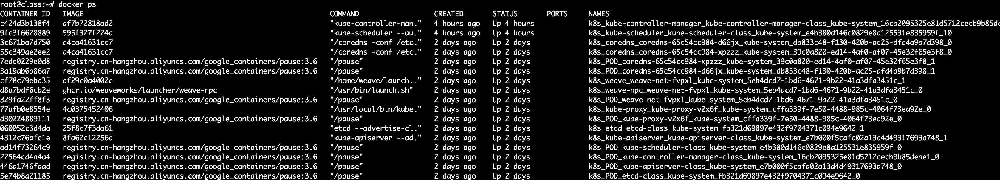
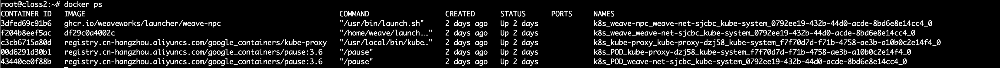
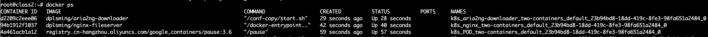
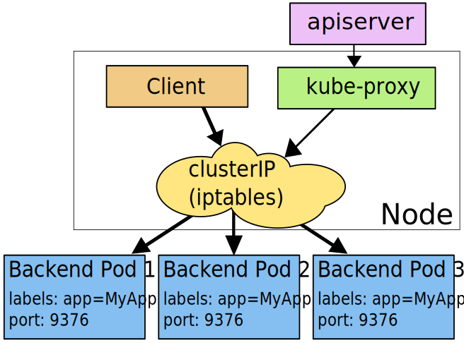
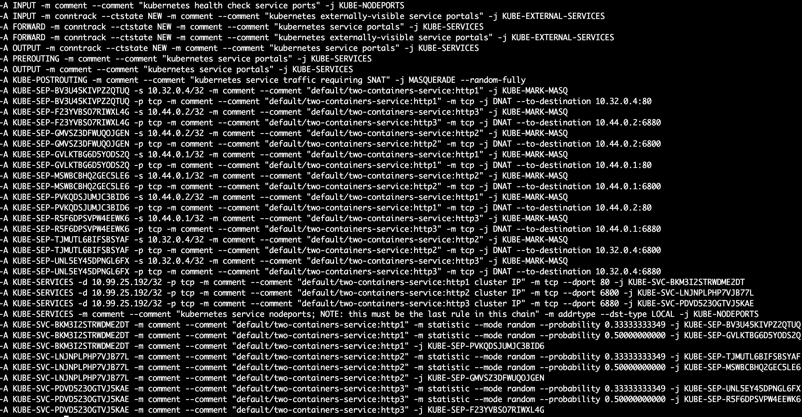

# Kubernetes实践 实验报告

### 519021910913 黄喆敏

**Q1**: 请记录所有安装步骤的指令，并简要描述其含义。

答：

1. #### 检查操作

- 对于两台机器，我们使用`ifconfig -a`获取网络接口的MAC地址。使用` cat /sys/class/dmi/id/product_uuid`命令对product_uuid校验。可得知两台机器MAC地址与product_uuid均不相同。

- 使用`lsmod | grep br_netfilter`指令，确保`br_netfilter`模块被加载。结果如下：

  ```shell
  cat <<EOF | sudo tee /etc/modules-load.d/k8s.conf
  br_netfilter
  EOF
  
  root@class:~# lsmod | grep br_netfilter
  br_netfilter           28672  0
  bridge                172032  1 br_netfilter
  ```

- 我们使用以下命令，使Linux节点上的iptables能够正确地查看桥接流量。使用`sysctl --system`，可看到配置正常执行。

  ```bash
  cat <<EOF | sudo tee /etc/sysctl.d/k8s.conf
  net.bridge.bridge-nf-call-ip6tables = 1
  net.bridge.bridge-nf-call-iptables = 1
  EOF
  
  root@class:~# sysctl --system
  ......
  * Applying /etc/sysctl.d/k8s.conf ...
  net.bridge.bridge-nf-call-ip6tables = 1
  net.bridge.bridge-nf-call-iptables = 1
  ```


2. #### 配置cgroup驱动

- **更改Docker的容器运行时。对于两台机器**，在初始化前，需要注意，Kubernetes的默认cgroup driver是`systemd`，而Docker是`cgroupfs`。因此我们修改Docker的cgroup driver为`systemd`。修改内容如下：

  ```shell
  sudo mkdir /etc/docker
  cat <<EOF | sudo tee /etc/docker/daemon.json
  {
    "exec-opts": ["native.cgroupdriver=systemd"],
    "log-driver": "json-file",
    "log-opts": {
      "max-size": "100m"
    },
    "storage-driver": "overlay2"
  }
  EOF
  ```

- 重新启动Docker并在启动时启用：

  ```shell
  sudo systemctl enable docker
  sudo systemctl daemon-reload
  sudo systemctl restart docker
  ```

- 以上两步在两台机器上都要完成，否则会出现`connection refused`的错误。


3. #### 安装kubeadm、kubelet和kubectl

- 更新`apt`包索引，并安装使用Kubernetes `apt`仓库所需要的包：

  ```shell
  sudo apt-get update
  sudo apt-get install -y apt-transport-https ca-certificates curl
  ```

- 下载Google Cloud公开签名密钥。此处需要改为阿里云国内镜像地址。

  ```shell
  sudo curl -fsSLo /usr/share/keyrings/kubernetes-archive-keyring.gpg https://mirrors.aliyun.com/kubernetes/apt/doc/apt-key.gpg
  ```

- 添加 Kubernetes `apt` 仓库。此处更改为阿里云`apt`地址。

  ```shell
  echo "deb [signed-by=/usr/share/keyrings/kubernetes-archive-keyring.gpg] https://mirrors.aliyun.com/kubernetes/apt/ kubernetes-xenial main" | sudo tee /etc/apt/sources.list.d/kubernetes.list
  ```

- 更新 `apt` 包索引，安装 kubelet、kubeadm 和 kubectl，并锁定其版本。

  ```shell
  sudo apt-get update
  sudo apt-get install -y kubelet kubeadm kubectl
  sudo apt-mark hold kubelet kubeadm kubectl
  ```


4. #### 使用kubeadm创建集群

- 输入`kubeadm config images list`，我们可以看到所需的镜像如下。此处无法正常拉取镜像，因此我们初始化`kubeadm`时更换为阿里云地址。

  ```shell
  k8s.gcr.io/kube-apiserver:v1.23.6
  k8s.gcr.io/kube-controller-manager:v1.23.6
  k8s.gcr.io/kube-scheduler:v1.23.6
  k8s.gcr.io/kube-proxy:v1.23.6
  k8s.gcr.io/pause:3.6
  k8s.gcr.io/etcd:3.5.1-0
  k8s.gcr.io/coredns/coredns:v1.8.6
  ```

- 我们在`class1`上运行以下命令，初始化控制平面节点。

  ```shell
  kubeadm init --image-repository registry.cn-hangzhou.aliyuncs.com/google_containers
  ```

- 完成后可看到以下信息：

  ```shell
  .......
  Your Kubernetes control-plane has initialized successfully!
  
  To start using your cluster, you need to run the following as a regular user:
  
    mkdir -p $HOME/.kube
    sudo cp -i /etc/kubernetes/admin.conf $HOME/.kube/config
    sudo chown $(id -u):$(id -g) $HOME/.kube/config
  
  Alternatively, if you are the root user, you can run:
  
    export KUBECONFIG=/etc/kubernetes/admin.conf
  
  You should now deploy a pod network to the cluster.
  Run "kubectl apply -f [podnetwork].yaml" with one of the options listed at:
    https://kubernetes.io/docs/concepts/cluster-administration/addons/
  
  Then you can join any number of worker nodes by running the following on each as root:
  
  kubeadm join 192.168.1.12:6443 --token lg7w2c.2qqd6bl23gk5yf9s \
          --discovery-token-ca-cert-hash sha256:8500a443695804b699a05b88850e67b89451e214225689bb14e153804f1a4ced 
  ```

- **对于两台机器**，我们都要将kubernetes master与本机绑定，设置本机的环境变量。

  ```bash
  export KUBECONFIG=/etc/kubernetes/admin.conf
  ```

- **对于控制平面节点**，我们采用weave作为Pod网络插件，使用以下命令安装：

  ```shell
  kubectl apply -f "https://cloud.weave.works/k8s/net?k8s-version=$(kubectl version | base64 | tr -d '\n')"
  ```

- 我们使用以下命令，对控制平面节点隔离，使得调度程序能够从任何地方调度Pods。（也可以不执行，这样只能在worker node上运行）

  ```bash
  kubectl nodes --all node-role.kubernetes.io/master-
  ```

- **对于普通节点**，我们输入以下命令，将新节点添加到集群。

  ```shell
  kubeadm join 192.168.1.12:6443 --token lg7w2c.2qqd6bl23gk5yf9s \
          --discovery-token-ca-cert-hash sha256:8500a443695804b699a05b88850e67b89451e214225689bb14e153804f1a4ced 
  ```

- 我们在控制节点运行`kubectl get nodes`指令，结果如下：

  ```shell
  NAME     STATUS   ROLES                  AGE     VERSION
  class    Ready    control-plane,master   38m     v1.23.6
  class2   Ready    <none>                 2m14s   v1.23.6
  ```

- 我们查看kube-proxy的log，部分结果如下。可以看到，kube-proxy采用iptables模式运转，符合要求。

  ```
  {"log":"I0424 05:20:06.010548       1 node.go:163] Successfully retrieved node IP: 192.168.1.12\n","stream":"stderr","time":"2022-04-24T05:20:06.01073339Z"}
  {"log":"I0424 05:20:06.010616       1 server_others.go:138] \"Detected node IP\" address=\"192.168.1.12\"\n","stream":"stderr","time":"2022-04-24T05:20:06.010769004Z"}
  {"log":"I0424 05:20:06.010649       1 server_others.go:561] \"Unknown proxy mode, assuming iptables proxy\" proxyMode=\"\"\n","stream":"stderr","time":"2022-04-24T05:20:06.010773498Z"}
  {"log":"I0424 05:20:06.153196       1 server_others.go:206] \"Using iptables Proxier\"\n","stream":"stderr","time":"2022-04-24T05:20:06.153370982Z"}
  {"log":"I0424 05:20:06.153245       1 server_others.go:213] \"kube-proxy running in dual-stack mode\" ipFamily=IPv4\n","stream":"stderr","time":"2022-04-24T05:20:06.153394559Z"}
  ......
  ```

  

**Q2**: 在两个节点上分别使用`ps aux | grep kube`列出所有和k8s相关的进程，记录其输出，并简要说明各个进程的作用。

答：

- 对于master节点，结果如下（部分结果太长，我们进行省略）：

```shell
root@class:~# ps aux | grep kube
root      213691  1.3  1.3 825176 107444 ?       Ssl  13:19   2:53 kube-controller-manager --authentication-kubeconfig=/etc/kubernetes/controller-manager.conf ......
root      213740  4.2  3.9 1111556 317744 ?      Ssl  13:19   9:30 kube-apiserver --advertise-address=192.168.1.12 --allow-privileged=true ......
root      213819  1.4  0.7 11215548 57692 ?      Ssl  13:19   3:07 etcd --advertise-client-urls=https://192.168.1.12:2379 --cert-file=/etc/kubernetes/pki/etcd/server.crt ......
root      213838  0.2  0.6 754804 54132 ?        Ssl  13:19   0:38 kube-scheduler --authentication-kubeconfig=/etc/kubernetes/scheduler.conf ......
root      214038  2.7  1.3 2011992 109820 ?      Ssl  13:19   6:00 /usr/bin/kubelet --bootstrap-kubeconfig=/etc/kubernetes/bootstrap-kubelet.conf ......
root      214431  0.0  0.4 748436 38312 ?        Ssl  13:20   0:02 /usr/local/bin/kube-proxy --config=/var/lib/kube-proxy/config.conf --hostname-override=class
root      218514  0.0  0.3 732444 25164 ?        Sl   13:30   0:00 /home/weave/kube-utils -run-reclaim-daemon -node-name=class -peer-name=8a:31:c9:ba:9a:6c -log-level=debug
root      300818  0.0  0.0   8160  2476 pts/0    S+   17:00   0:00 grep --color=auto kube
```

- master节点上各个进程作用如下：

  - `kube-controller-manager`:运行所有的Controller进程；监控整个集群的状态；确保集群中的真实状态与期望状态一致。

  - `kube-apiserver`：验证并配置 API 对象的数据，这些对象包括 Pods、Services、ReplicaSet 等。 API 服务器为 REST 操作提供服务，并为集群的共享状态提供前端， 所有其他组件都通过该前端进行交互。

  - `etcd`：高可靠的key-value键值存储，记录集群中的所有持久化数据，记录集群中的各种状态。

  - `kube-scheduler`：负责将Pods指派到Node上。调度器基于约束和可用资源为调度队列中每个Pod确定其可合法放置的节点，之后对所有合法的节点进行排序，将 Pod 绑定到一个合适的节点。 

  - `kubelet`：kubelet 是在<u>每个 Node 节点上运行的主要“节点代理”</u>。kubelet 是基于 PodSpec 来工作的。每个 PodSpec 是一个描述 Pod 的 YAML 或 JSON 对象。 kubelet 接受通过各种机制（主要是通过 apiserver）提供的一组 PodSpec，<u>并确保这些 PodSpec 中描述的容器处于运行状态且运行状况良好</u>。 kubelet 不管理不是由 Kubernetes 创建的容器。

  - `kube-proxy`：Kubernetes 网络代理在<u>每个节点上运行</u>。网络代理反映了每个节点上 Kubernetes API 中定义的服务，并且可以执行简单的 TCP、UDP 和 SCTP流转发。 当前可通过 Docker-links-compatible 环境变量找到服务集群 IP 和端口， 这些环境变量指定了服务代理打开的端口。 有一个可选的插件，可以为这些集群 IP 提供**集群 DNS**。 **用户必须使用 apiserver API 创建服务才能配置代理**。

  - `kube-utils`：与安装的网络插件weave相关。

    

- 对于普通节点，结果如下。普通节点包含的进程作用已在上文所述。

```bash
root@class2:~# ps aux | grep kube
root      192242  1.6  1.2 2010968 103592 ?      Ssl  13:56   3:04 /usr/bin/kubelet --bootstrap-kubeconfig=/etc/kubernetes/bootstrap-kubelet.conf ......
root      192590  0.0  0.4 748692 39408 ?        Ssl  13:56   0:02 /usr/local/bin/kube-proxy --config=/var/lib/kube-proxy/config.conf --hostname-override=class2
root      193146  0.0  0.2 732188 24388 ?        Sl   13:57   0:00 /home/weave/kube-utils -run-reclaim-daemon -node-name=class2 -peer-name=32:ed:4f:90:26:3a -log-level=debug
root      254132  0.0  0.0   8160  2576 pts/0    S+   17:01   0:00 grep --color=auto kube
```


**Q3**: 在两个节点中分别使用`docker ps`显示所有正常运行的docker容器，记录其输出，并简要说明各个容器所包含的k8s组件，以及哪些k8s组件未运行在容器中。

答：

- 对于master节点，结果如下。包含的k8s组件有`kube-controller-manager` , `kube-scheduler` , `coredns`（DNS服务器）, `kube-proxy` , ` kube-apiserver` , `etcd` 和`weave`网络插件。
- `kubelet`不会运行在容器中。




- 对于普通节点，结果如下。包含的k8s组件有`kube-proxy`和`weave`网络插件。同样地，`kubelet`不会运行在容器里。




**Q4**: 请采用声明式接口对Pod进行部署，并将部署所需的yml文件记录在实践文档中。

答：我们将部署内容记录在`two-containers.yaml`中，内容如下。接着运行`kubectl apply -f two-containers.yaml `指令进行部署。

```yaml
apiVersion: v1
kind: Pod
metadata:
  name: two-containers
  labels:
  	app: two-containers
spec:
  volumes:
  - name: shared-data
    emptyDir: {}

  containers:
  - name: nginx
    image: dplsming/nginx-fileserver:1.0
    ports:
      - containerPort: 80
      	hostPort: 8080
    volumeMounts:
      - name: shared-data
        mountPath: /usr/share/nginx/html/files

  - name: aria2ng-downloader
    image: dplsming/aria2ng-downloader:1.0
    ports:
      - containerPort: 6800
      	hostPort: 6800
      - containerPort: 6880
      	hostPort: 6880
    volumeMounts:
      - name: shared-data
        mountPath: /data
```


**Q5**: 请在worker节点上，在部署Pod的前后分别采用`docker ps`查看所有运行中的容器并对比两者的区别。请将创建该Pod所创建的全部新容器列举出来，并一一解释其作用。

答：以下为Pod所创建的新容器。

- `k8s_aria2ng-downloader_two-containers` 和 `k8s_nginx_two-containers`为Pod中所包含的容器镜像。

- `k8s_POD_two-containers`为`pause`容器。k8s中，用`pause`容器来作为一个Pod中所有容器的**父容器**。

  `pause`容器有两个核心功能：它提供整个pod的Linux命名空间的基础；启用PID命名空间，开启init进程，并回收僵尸进程。

                          


**Q6**: 请结合博客 https://blog.51cto.com/u_15069443/4043930 的内容，将容器中的veth与host机器上的veth匹配起来，并采用`ip link`和`ip addr`指令找到位于host机器中的所有网络设备及其之间的关系。结合两者的输出，试绘制出worker节点中涉及新部署Pod的所有网络设备和其网络结构，并在图中标注出从master节点中使用cluster ip访问位于worker节点中的Pod的网络路径。

答：

- 首先我们进入nginx-fileserver，查看host/container veth pair关系。由于该容器不能运行ip指令，首先使用`apt-get update & apt-get install -y iproute2`安装包。

- 执行`ip link show eth0`指令，可以看到35是对应的index。

  ```bash
  35: eth0@if36: <BROADCAST,MULTICAST,UP,LOWER_UP> mtu 1376 qdisc noqueue state UP mode DEFAULT group default
      link/ether 36:ef:06:ad:c8:28 brd ff:ff:ff:ff:ff:ff link-netnsid 0
  ```
  
- 接着退出到host，在host下执行指令，查看对应的veth interface。

  ```
  36: vethwepl551c56d@if35: <BROADCAST,MULTICAST,UP,LOWER_UP> mtu 1376 qdisc noqueue master weave state UP mode DEFAULT group default
  ```

- 我们在host下使用`ip_addr`，结果如下所示：

  ```bash
  1: lo: <LOOPBACK,UP,LOWER_UP> mtu 65536 qdisc noqueue state UNKNOWN mode DEFAULT group default qlen 1000
      link/loopback 00:00:00:00:00:00 brd 00:00:00:00:00:00
  2: ens3: <BROADCAST,MULTICAST,UP,LOWER_UP> mtu 1450 qdisc fq_codel state UP mode DEFAULT group default qlen 1000
      link/ether fa:16:3e:5e:52:bc brd ff:ff:ff:ff:ff:ff
  3: docker0: <NO-CARRIER,BROADCAST,MULTICAST,UP> mtu 1500 qdisc noqueue state DOWN mode DEFAULT group default
      link/ether 02:42:aa:b2:09:97 brd ff:ff:ff:ff:ff:ff
  4: datapath: <BROADCAST,MULTICAST,UP,LOWER_UP> mtu 1376 qdisc noqueue state UNKNOWN mode DEFAULT group default qlen 1000
      link/ether 2a:f4:1f:36:ec:23 brd ff:ff:ff:ff:ff:ff
  6: weave: <BROADCAST,MULTICAST,UP,LOWER_UP> mtu 1376 qdisc noqueue state UP mode DEFAULT group default qlen 1000
      link/ether 32:ed:4f:90:26:3a brd ff:ff:ff:ff:ff:ff
  8: vethwe-datapath@vethwe-bridge: <BROADCAST,MULTICAST,UP,LOWER_UP> mtu 1376 qdisc noqueue master datapath state UP mode DEFAULT group default
      link/ether 46:21:b7:98:18:58 brd ff:ff:ff:ff:ff:ff
  9: vethwe-bridge@vethwe-datapath: <BROADCAST,MULTICAST,UP,LOWER_UP> mtu 1376 qdisc noqueue master weave state UP mode DEFAULT group default
      link/ether 46:e2:9c:88:34:12 brd ff:ff:ff:ff:ff:ff
  10: vxlan-6784: <BROADCAST,MULTICAST,UP,LOWER_UP> mtu 65535 qdisc noqueue master datapath state UNKNOWN mode DEFAULT group default qlen 1000
      link/ether b6:3d:fb:1c:fa:02 brd ff:ff:ff:ff:ff:ff
  36: vethwepl551c56d@if35: <BROADCAST,MULTICAST,UP,LOWER_UP> mtu 1376 qdisc noqueue master weave state UP mode DEFAULT group default
      link/ether b2:5e:14:aa:af:6b brd ff:ff:ff:ff:ff:ff link-netnsid 0
  ```

- weave 网络包含两个虚拟交换机： weave 和 datapath， vethwe-bridge 和 vethwe-datapath 将二者连接在一起；weave 和 datapath 分工不同，weave 负责将容器接入 weave 网络，datapath 负责在主机间vxlan 隧道中并收发数据。

- 因此，我们可以绘制下图。**其中红线代表从master节点使用cluster ip访问位于worker节点中的Pod的网络路径。**

  


**Q7**: 请采用声明式接口对Service进行部署，并将部署所需的yml文件记录在实践文档中。

答：我们将部署内容记录在`two-containers-service.yaml`中，内容如下。接着运行`kubectl apply -f two-containers-service.yaml `指令进行部署。

```yaml
apiVersion: v1
kind: Service
metadata:
  name: two-containers-service
spec:
  type: ClusterIP
  selector:
    app: two-containers
  ports:
  - name: http1
    protocol: TCP
    port: 80
  - name: http2
    protocol: TCP
    port: 6800
  - name: http3
    protocol: TCP
    port: 6880
```


**Q8**: 请在master节点中使用`iptables-save`指令输出所有的iptables规则，将其中与Service访问相关的iptable规则记录在实践文档中，并解释网络流量是如何采用基于iptables的方式被从对Service的cluster IP的访问定向到实际的Pod中的。

答：我们使用`grep`过滤相关的命令并输出，如下所示。

```bash
-A PREROUTING -m comment --comment "kubernetes service portals" -j KUBE-SERVICES
-A OUTPUT -m comment --comment "kubernetes service portals" -j KUBE-SERVICES
-A KUBE-POSTROUTING -m comment --comment "kubernetes service traffic requiring SNAT" -j MASQUERADE --random-fully

-A KUBE-SEP-GVLKTBG6D5YODS2Q -s 10.44.0.1/32 -m comment --comment "default/two-containers-service:http1" -j KUBE-MARK-MASQ
-A KUBE-SEP-GVLKTBG6D5YODS2Q -p tcp -m comment --comment "default/two-containers-service:http1" -m tcp -j DNAT --to-destination 10.44.0.1:80
-A KUBE-SEP-MSWBCBHQ2GEC5LE6 -s 10.44.0.1/32 -m comment --comment "default/two-containers-service:http2" -j KUBE-MARK-MASQ
-A KUBE-SEP-MSWBCBHQ2GEC5LE6 -p tcp -m comment --comment "default/two-containers-service:http2" -m tcp -j DNAT --to-destination 10.44.0.1:6800
-A KUBE-SEP-R5F6DPSVPW4EEWK6 -s 10.44.0.1/32 -m comment --comment "default/two-containers-service:http3" -j KUBE-MARK-MASQ
-A KUBE-SEP-R5F6DPSVPW4EEWK6 -p tcp -m comment --comment "default/two-containers-service:http3" -m tcp -j DNAT --to-destination 10.44.0.1:6880

-A KUBE-SERVICES -d 10.99.25.192/32 -p tcp -m comment --comment "default/two-containers-service:http1 cluster IP" -m tcp --dport 80 -j KUBE-SVC-BKM3I2STRWDME2DT
-A KUBE-SERVICES -d 10.99.25.192/32 -p tcp -m comment --comment "default/two-containers-service:http2 cluster IP" -m tcp --dport 6800 -j KUBE-SVC-LNJNPLPHP7VJB77L
-A KUBE-SERVICES -d 10.99.25.192/32 -p tcp -m comment --comment "default/two-containers-service:http3 cluster IP" -m tcp --dport 6880 -j KUBE-SVC-PDVD523OGTVJ5KAE

-A KUBE-SVC-BKM3I2STRWDME2DT -m comment --comment "default/two-containers-service:http1" -j KUBE-SEP-GVLKTBG6D5YODS2Q
-A KUBE-SVC-LNJNPLPHP7VJB77L -m comment --comment "default/two-containers-service:http2" -j KUBE-SEP-MSWBCBHQ2GEC5LE6
-A KUBE-SVC-PDVD523OGTVJ5KAE -m comment --comment "default/two-containers-service:http3" -j KUBE-SEP-R5F6DPSVPW4EEWK6
```

**KUBE-SERVICES**：包含所有 ClusterIP 类型 Service 的流量匹配规则，由 PREROUTING 和 OUTPUT 两个内置链直接调用。每个 Service 对象包含两条规则定义，对于所有发往该 Service的请求报文：前一条规则用于为非源自 Pod 网络中的请求报文打上特有的防火墙标记，<u>后一条规则负责将所有报文转至专用的以 KUBE-SVC 为名称前缀的自定义链</u>。

**KUBE-SVC-\<HASH>**：定义一个服务的流量调度规则，它通过随机调度算法将请求分发给该 Service 的所有后端端点，每个后端端点定义在以 KUBE-SEP 为前缀名称的自定义链上，后缀是端点信息的 hash 值。

**KUBE-SEP-\<HASH>**：定义一个端点相关的流量处理规则。它通常包含两条规则：前一条用于为那些源自该端点自身的流量请求调用自定义链 KUBE-MARQ-MASK，打上特有的防火墙标记；<u>后一条负责对发往该端点的所有流量进行目标 IP 地址和端口转换，新目标为该端点的 IP 和端口</u>。


我们可以看到，对于Service的每个端口，都有一条`KUBE-SERVICES`规则、一个`KUBE-SVC-<HASH>`链。对于每个Pod末端，应该存在一条`KUBE-SVC-<HASH>`链和`KUBE-SEP-<HASH>`链与之对应。

**如果是非当前Node的访问，网络流量先进入`PREROUTING`，再进入`KUBE-SERVICES`，选择对应的`KUBE-SVC-<HASH>`链以及Pod对应的`KUBE-SEP-<HASH>`链。最后通过dnat，定向到真实Pod中的地址。**

**如果是当前Node的访问，网络流量先进入`OUTPUT`，再进入`KUB-SERVICES`，之后过程与上述相同。**


**Q9**: kube-proxy组件在整个service的定义与实现过程中起到了什么作用？请自行查找资料，并解释在iptables模式下，kube-proxy的功能。

答：

- kube-proxy负责services和endpoints在各节点的具体实现。与kubelet类似，<u>kube-proxy会在每个节点运行一个实例，为services提供简单的TCP、UDP和SCTP流量转发，转发到对应的endpoints上</u>。

  kube-proxy在新的节点上启动时，会初始化ServiceConfig对象，订阅Service的变更事件。收到变更后，kube-proxy会自动更新相应的规则。

- iptables并不是并不是真正的防火墙，而是一个客户端工具。 用户通过iptables去操作真正的防火墙 netfilter。 netfilter位于内核态。 netfilter/iptables 组合提供<u>封包过滤、封包重定向和NAT</u>等功能。

  在iptables模式下，kube-proxy会将规则附加到“NAT pre-routing” hook上，**以实现NAT和负载均衡的功能**。
  
  




**Q10**: 请采用声明式接口对Deployment进行部署，并将Deployment所需要的yml文件记录在文档中。

答：

- 我们将部署内容记录在`two-containers-deployment.yaml`中，内容如下。接着运行`kubectl apply -f two-containers-deployment.yaml `指令进行部署。部署完成后，删除之前部署的Pod。运行命令时，可能会出现从节点connection refused的问题，可以参照[9]中的内容，先对环境变量进行配置。

```yaml
apiVersion: apps/v1
kind: Deployment
metadata:
  name: two-containers-deployment
spec:
  replicas: 3
  selector:
    matchLabels:
      app: two-containers
  template:
    metadata:
      labels:
        app: two-containers
    spec:
      volumes:
        - name: shared-data
          emptyDir: { }
      containers:
        - name: nginx
          image: dplsming/nginx-fileserver:1.0
          ports:
            - containerPort: 80
          volumeMounts:
            - name: shared-data
              mountPath: /usr/share/nginx/html/files
        - name: aria2ng-downloader
          image: dplsming/aria2ng-downloader:1.0
          ports:
            - containerPort: 6800
            - containerPort: 6880
          volumeMounts:
            - name: shared-data
              mountPath: /data
```

- 运行`kubectl get deployments`，我们可以看到Deployment已经部署成功。

```bash
NAME                        READY   UP-TO-DATE   AVAILABLE   AGE
two-containers-deployment   3/3     3            3           83s
```

- 对于service，我们可以运行`kubectl edit service two-containers-service`进行修改。


**Q11**: 请在master节点中使用`iptables-save`指令输出所有的iptables规则，将其中与Service访问相关的iptable规则记录在实践文档中，并解释网络流量是如何采用基于iptable的方式被从对Service的cluster ip的访问，以随机且负载均衡的方式，定向到Deployment所创建的实际的Pod中的。

答：

- 以下为master节点中相关的规则。由于过长，我们采用截图的方式记录。

- 与之前类似，如果是非当前Node的访问，网络流量先进入`PREROUTING`，再进入`KUBE-SERVICES`，选择对应的`KUBE-SVC-<HASH>`链以及Pod对应的`KUBE-SEP-<HASH>`链。最后通过dnat，定向到真实Pod中的地址；如果是当前Node的访问，网络流量先进入`OUTPUT`，再进入`KUB-SERVICES`，之后过程与上述相同。
- 需要注意的是，此处一条`KUBE_SVC-<HASH>`链会对应多条`KUB-SEP-<HASH>`链。流经第一条规则时，有1/3的概率会进入对应的`KUB-SEP-<HASH>`链。若不进入，则匹配第二条规则，有1/2的概率进入对应的`KUB-SEP-<HASH>`链。若不进入，则匹配第三条规则，直接进入对应的链。因此，进入三条链的概率都是1/3，实现了随机且负载均衡。




**Q12**: 在该使用Deployment的部署方式下，不同Pod之间的文件是否共享？该情况会在实际使用文件下载与共享服务时产生怎样的实际效果与问题？应如何解决这一问题？

答：由于我们没有指定hostPath，因此不同Pod之间的文件不共享。这会导致实际使用文件下载与共享时，例如一个Pod上共享了一个文件，但在另外的Pod上看不到。我们可以采用**持久卷（Presistent Volume）**来解决这个问题。我们首先创建PV，PVC。对于Deployment而言，可以在配置中申领一块PVC，PVC申领会耗用PV资源，每个Pod共享一块PV，因此解决了这一问题。

​		对于PV，我们可以采用挂载到本地目录，或者使用NFS均可。


### Reference

[1] https://blog.csdn.net/sinat_32900379/article/details/122135698

[2] https://kubernetes.io/zh/docs/tasks/manage-kubernetes-objects/declarative-config/

[3] https://kubernetes.io/zh/docs/tasks/access-application-cluster/communicate-containers-same-pod-shared-volume/

[4] https://kubernetes.io/zh/docs/concepts/services-networking/service/

[5] https://kubernetes.io/zh/docs/tasks/debug-application-cluster/debug-service/

[6] https://blog.51cto.com/key3feng/4697116

[7] https://www.bilibili.com/read/cv9137641/

[8] https://github.com/Kevin-fqh/learning-k8s-source-code

[9] https://www.cnblogs.com/wangzy-Zj/p/13958054.html

[10] https://stackoverflow.com/questions/52150813/shared-directory-for-a-kubernetes-deployment-between-its-replicas